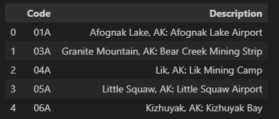
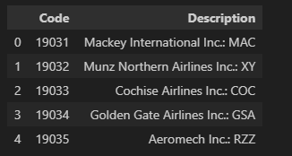
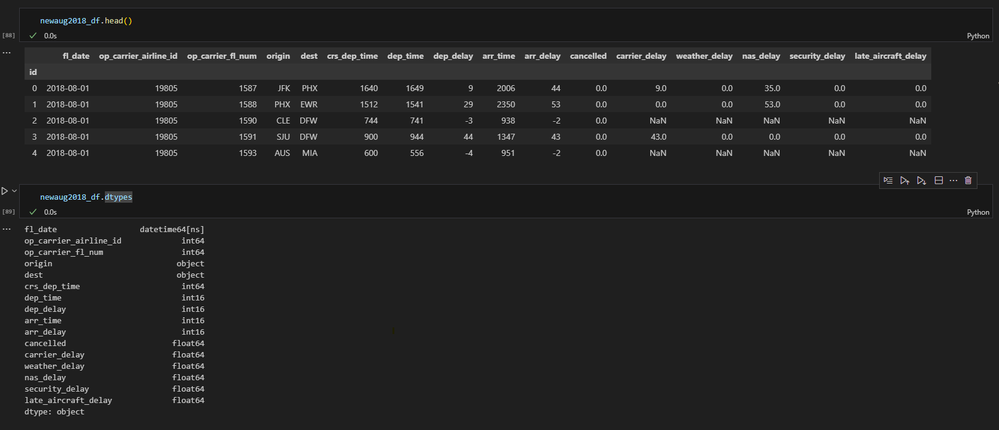

# Airline On-Time Performance Statistics
This project is created for the University of Minnesota - Data Visualization and Analytics Bootcamp - Project 3.

### Contributors:

1. Aliyu Muraina
2. David Kogge
3. Indu Bandi
4. Saudia Epps

## Project Overview

The dataset contains the Flight-level performance data from the US Department of Transportation, Bureau of Transportation Statistics, on the arrival and departure performance of domestic flights operated by air carriers that are required to (or voluntarily) report to the US Department of Transportation.

For the Airline project, the team chose to perform the tasks under **Data Engineering Track** as below.

### Data Cleanup

1. Downloaded the airline performance dataset from [data world](https://data.world/dot/airline-on-time-performance-statistics) and saved the zip file under [Resources](Resources/dot-airline-on-time-performance-statistics/) in the git repo.

2. Imported the zipfile library In the [airport_data_cleanup](./airport_data_cleanup.ipynb) Jupyter Notebook, to extract the dataset downloaded in step1 to Resources folder as shown

    Note: Extracted files under the "Resources" folder are not uploaded to git due to the size. They are mentioned to be excluded in .gitignore

    

3. Dataset contains 3 files.

    a. Airports - this file contains the airport data with code and description as shown. The file contains 6510 rows

    

    Data in the description column were split by commas, columns were renamed, and null values were removed as steps to clean the data. The final product created the airports.csv file under the "Updated_CSVs" folder. The transformed "airports" data is shown below
    
    

    b. Air Carriers - this file contains the aircarriers code and description as shown. The file contains 1656 rows of Aircarriers Data

    

    Data in the description is then split by colon and space, renamed the columns as needed and the transformed data is saved into aircarriers.csv under the Updated_CSVs folder. Transformed aircarriers data is shown below

    

    c. August 2018 Nationwide - this file contains the aircarriers data for August 2018. The columns are air carrier ID, origin and destination airports, delay information, and cause for the delays if any. Data in the original CSV is as shown. This file contains 701,352 rows of data

    

    DataFrame is reviewed and formatted to keep the required columns and drop the rest. Converted the types of a few columns as needed. and transformed Aug 2018 data is saved into aug2018.csv under the Updated_CSVs folder. Transformed Data is shown below

    

4. Updated_CSVs generated are as shown in the folder structure

    

### Database Design

Airline performance Dataset is drawn from different sources into multiple datasets, has multi-row transactions, and the data are more structured, hence we chose Relational Database Management System(RDMS) - Postgres as our database in this project.

The Airline Database contains 3 tables to hold data from 3 CSVs. Entity Relationship Diagram is designed as shown below

    a. airport_data
    b. air_carrier_data
    c. august_2018

## Instructions to upload CSV data to the database

1. Create airline_db in pgAdmin as shown

2. In the new query tool for airline_db created in step 1, execute the [QuickDBD-AIRPORT.sql](./QuickDBD-AIRPORT.sql) file to create the required tables as per ERD.

3. The screenshot below shows the tables created and that there are NO rows in the tables yet

4. Import the data from the Updated_CSVs folder using the pgAdmin import process as shown

5. Once the data is imported in the order of airport_data, air_carrier_data, and august_2018, to avoid any foreign key constraints, the table counts in the database are as shown

## Instructions to read from the database to use Seaborn for visualizations

To further showcase what can be done with the summarized data stored in Postgres, SQLAlchemy was used in conjunction with Pandas to connect to the database. The table used for the example was august_2018, where a query filtered to show delays from the Minneapolis-Saint Paul (MSP) airport was applied. That DataFrame would later be used to feed the Seaborn module. Flights were considered to be delayed had a dep_delay value greater than 0 and the origin of interest was MSP. The delayed flights under these criteria were visualized using Seaborn, with the count of delayed flights being charted by day for August 2018 as shown below

## Ethical Considerations
We reviewed the data and the source documentation.  All the information is provided by the US DOT and relates to public companies in a highly regulated industry.  We did not find any of the data to be ethically concerning.

## References

1. Dataset: https://data.world/dot/airline-on-time-performance-statistics
2. Dataset Definitions: https://www.transtats.bts.gov/DatabaseInfo.asp?QO_VQ=EFD&Yv0x=D
3. Reset index for dataframe: https://stackoverflow.com/questions/20167930/start-index-at-1-for-pandas-dataframe
4. Seaborn Documentation: https://pypi.org/project/seaborn/
